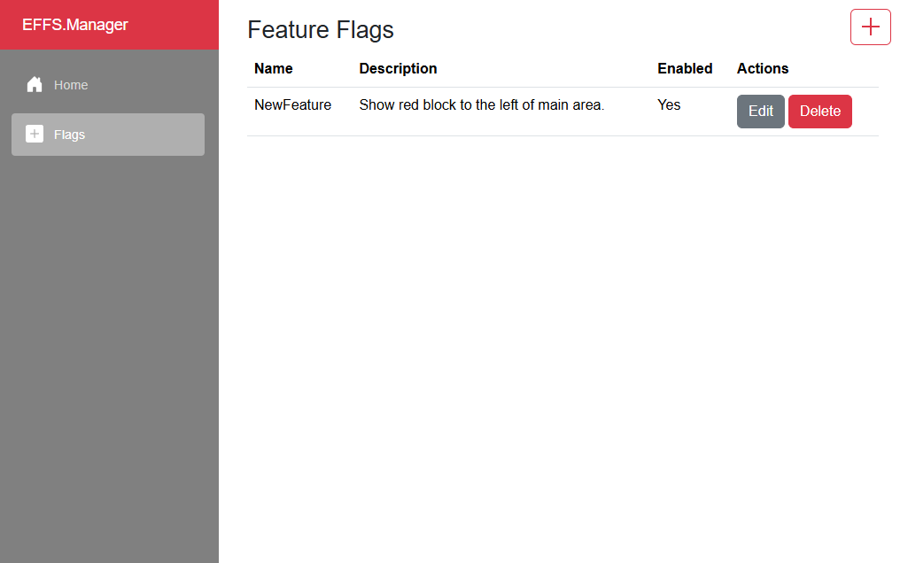
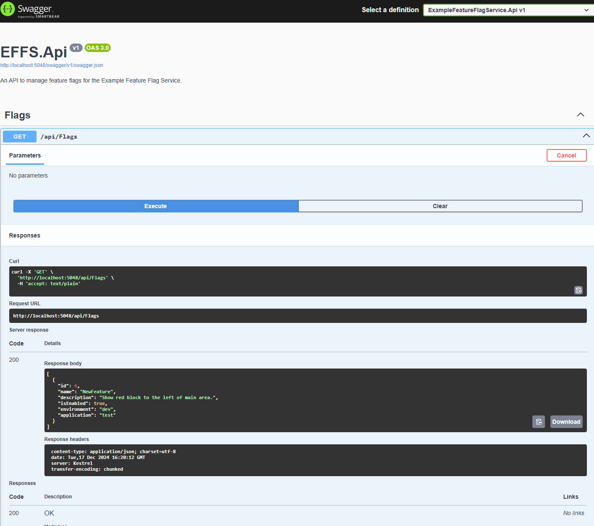
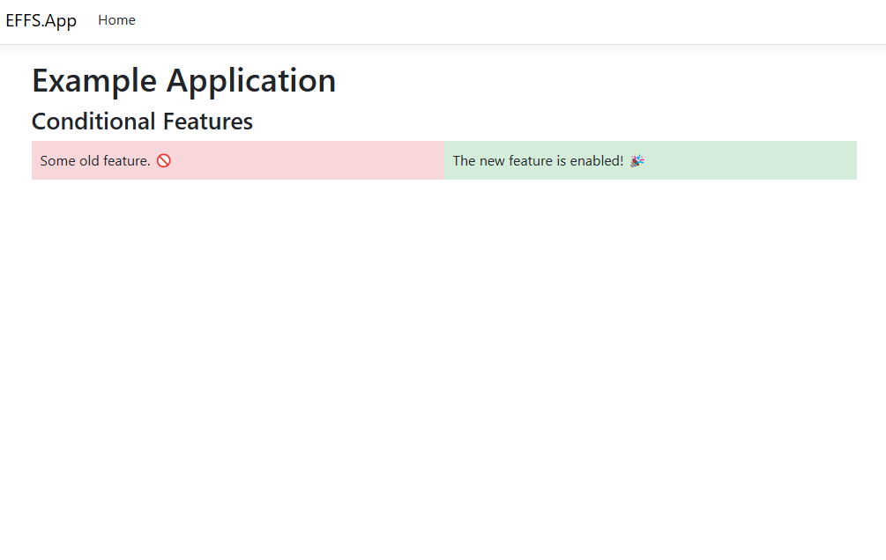

# Example Feature Flagging Service (FFS) Demo

This is a demo project that shows working components of a SaaS solution to **Feature Flagging**. In a nutshell - nothing really special (this is not about you, Microsoft) - but just a showcase of how to utilize simple booleans (and meta around them) as a dedicated service. The service allows managing feature flags that can be used to enable or disable specific features in an application dynamically, without redeploying code. The project demonstrates a complete solution, including a backend API, a client management application, an example application, and an SDK for reuse.

<div style="display: flex; justify-content: space-around;">
    
    
    
</div>

## Project Structure

### 1. **FeatureFlagService.API**
A C# **ASP.NET Core Web API** for managing feature flags.

#### Features:
- CRUD operations for feature flags:
  - Create, Read, Update, Delete
- Query feature flags by environment and application.
- Built with `.NET 9` for modern APIs.

#### Endpoints:
- `GET /api/flags` - Get all feature flags.
- `GET /api/flags/{id}` - Get a specific feature flag by ID.
- `POST /api/flags` - Create a new feature flag.
- `PUT /api/flags/{id}` - Update an existing feature flag.
- `DELETE /api/flags/{id}` - Delete a feature flag.

---

### 2. **FeatureFlagService.Client**
A **Blazor WebAssembly** client for managing feature flags via a modern web UI.

#### Features:
- View the list of feature flags.
- Add, edit, and delete feature flags.
- Enable or disable feature flags for specific environments and applications.

---

### 3. **FeatureFlagService.SDK**
A reusable SDK for interacting with the Feature Flagging Service API.

#### Features:
- Simplifies API calls for fetching, creating, updating, and deleting feature flags.
- Provides utility methods like `IsFeatureEnabled` for dynamic feature checks.
- Designed for easy reuse in any .NET application.

---

### 4. **FeatureFlagService.ExampleApp**
An example **ASP.NET Core MVC Application** that demonstrates how to consume feature flags.

#### Features:
- Dynamically enables or disables UI elements based on feature flags.

---

## Prerequisites

To run the project, ensure you have the following installed:
- **.NET SDK 9.0** or later
- **dotnet-ef** - entity framework tools used for working with migrations

```ssh
dotnet tool install --global dotnet-ef
```

---

## How to Run

### 1. Clone the Repository

### 2. Ensure you have the necessary packages installed:
   
```sh
   dotnet restore
```

### 2. Build and Run the API - `http://localhost:5048/swagger/index.html`

SQLite generates two files once you run the application - featureflags.db-shm and featureflags.db-wal. They are related to the Write-Ahead Logging (WAL) mode. They are used for transaction management and performance optimization. Before you build and run the API project, you must regenerate and update a local instance of the SQLite db.

```sh
cd src/ExampleFeatureFlagService.Api
dotnet ef database update
dotnet run
```

### 3. (Optional) Build and Run the Manager (User Client) Application - `http://localhost:5296/`

```sh
cd src/ExampleFeatureFlagService.Client
dotnet run
```

### 4. (Optional) Build and Run the Example (Consumer Client) Application - `http://localhost:5243/` 

```sh
cd src/ExampleFeatureFlagService.ExampleApp
dotnet run
```

> if any of the ports used for the 3 runtimes is already in use, you might have to update couple of things around, but assumption is - at this point you should know what, how and where. (psst, launchSettigns and Program startups...)

## SDK Usage
The SDK can be used by direct reference, but for sake of demo - a nuget pkg is build relative to the source code and registered as local nuget source. In turn thats used by respective projects (Manager & ExampleApp). Any changes to the source code of the SDK, would require a rebuild and pack:

```sh
dotnet pack -o ./nupkgs
```

> Versioning is omit for the sake of simplicity of the demo.

## Demo Flag
To fully close the demo, one must generate a flag named `NewFeature`. Try disabling and enabling it and observe the changes inside the ExampleApp home page. :)

## Key Technologies

- .NET 9
- Blazor WebAssembly for the client
- ASP.NET Core MVC for the example app
- HttpClient for API interaction
- SDK for shared logic and reusability